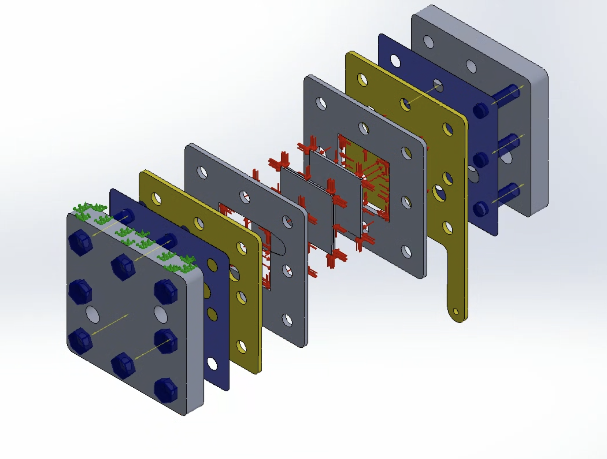
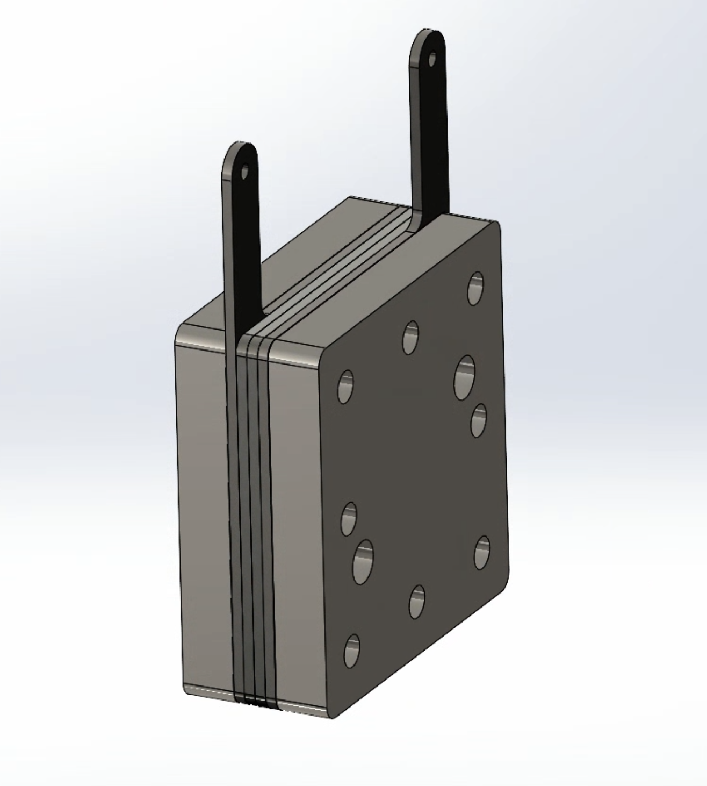
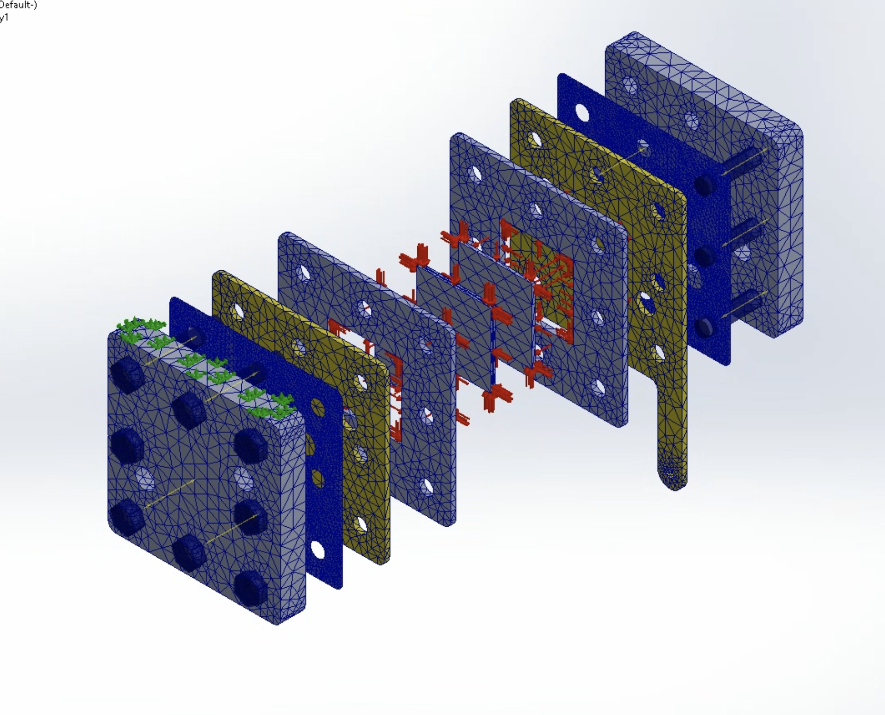
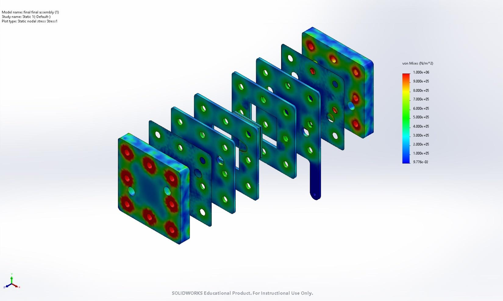
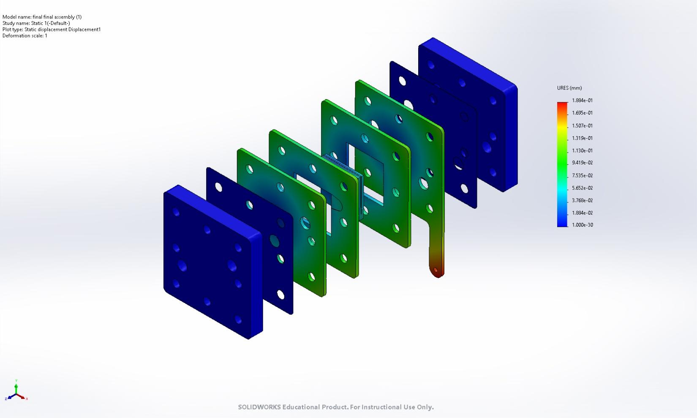
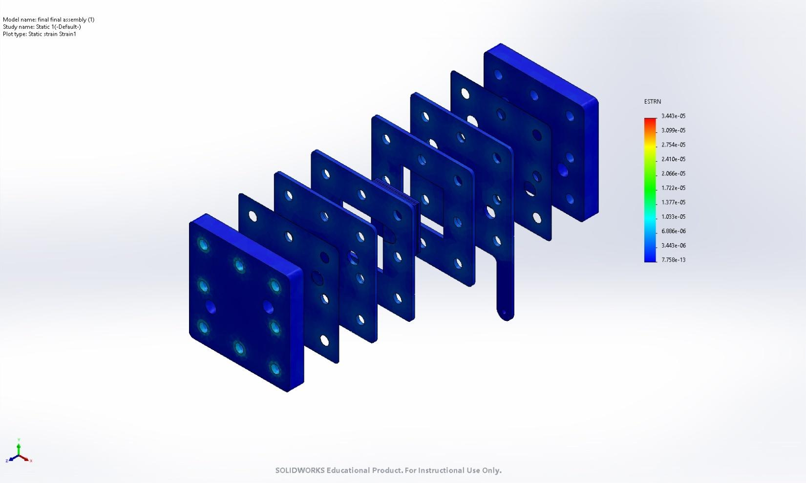

# Structural Analysis of a High-Pressure PEM Electrolyser Using FEA

Design and finite element validation of a high-pressure Proton Exchange Membrane (PEM) electrolyser assembly, built in SolidWorks and evaluated under 10 bar internal pressure and bolt-preload conditions using SOLIDWORKS Simulation. The study covers von-Mises stress, resultant displacement, and equivalent strain across the full stack to confirm structural readiness ahead of fabrication.


## Table of Contents
- [Overview](#overview)
- [Objectives](#objectives)
- [Working Principle](#working-principle)
- [CAD Assembly](#cad-assembly)
- [Materials](#materials)
- [FEA Setup](#fea-setup)
- [Mesh](#mesh)
- [Results](#results)
- [Discussion](#discussion)
- [Challenges & Learnings](#challenges--learnings)
- [Conclusion](#conclusion)
- [Tools Used](#tools-used)
- [Future Work](#future-work)
- [References](#references)


## Overview

Water electrolysis is one of the more viable routes to carbon-free hydrogen when the input electricity is renewable, and PEM electrolysers in particular are attractive for this because of their compact stack design, fast response, and ability to run at high current density and elevated pressure - which cuts down on downstream compression needs for storage. That last point is also what makes them mechanically demanding: running the stack at pressure puts the end plates, bolted joints, and sealing interfaces under combined loading that has to be verified before any hardware gets cut.

This repo documents that verification step. A full electrolyser assembly - end plates, current collectors, membrane-electrode assembly (catalyst layers + Nafion membrane), gas diffusion layers, nickel foam, gaskets, and the bolted fastening system - was modeled in SolidWorks and put through static structural FEA under simultaneous internal pressure and bolt preload to check whether the design holds up before moving to fabrication.

## Objectives

- Design a complete PEM electrolyser assembly in SolidWorks.
- Set up and run static structural FEA in SOLIDWORKS Simulation.
- Characterize stress and deformation behavior under internal pressure loading.
- Quantify the effect of bolt preload on the sealing interfaces.
- Flag design changes needed for safe, leak-free operation.
- Sign off the geometry for fabrication.

## Working Principle

A PEM electrolyser splits water into hydrogen and oxygen electrochemically:

```
2H₂O(l) → 2H₂(g) + O₂(g)
```

| Electrode | Half-reaction |
|---|---|
| Anode   | H₂O → ½O₂ + 2H⁺ + 2e⁻ |
| Cathode | 2H⁺ + 2e⁻ → H₂ |

A Nafion membrane carries protons from anode to cathode while keeping the product gases from mixing - this membrane, sandwiched between the catalyst layers, is what the entire mechanical stack exists to clamp and seal.

## CAD Assembly

The stack was modeled part-by-part and assembled with mates reflecting the real clamping order - end plates on the outside, current collectors, gaskets, GDLs, catalyst layers and membrane in the center, held together by 8 through-bolts.

<p align="center">
  <br>
  <em>Exploded assembly showing the full bolt-clamped stack order</em>
</p>

<p align="center">
  <br>
  <em>Final assembled model with mounting tabs</em>
</p>

**Stack components:** end plates · current collectors · silicone gaskets · Nafion membrane · anode/cathode catalyst layers · nickel foam · gas diffusion layers · bolts and nuts.

## Materials

Material selection balanced conductivity/corrosion resistance for the wetted electrochemical parts against strength and stiffness for the structural clamp:

| Component | Material |
|---|---|
| End Plates | Aluminium |
| Current Collector | Titanium |
| Gas Diffusion Layer | Titanium Felt |
| Nickel Foam | Nickel Foam |
| Membrane | Nafion |
| Gaskets | Silicone |
| Bolts & Nuts | Alloy / Stainless Steel |
| Anode Catalyst Layer | Iridium Oxide |
| Cathode Catalyst Layer | Platinum |

Key mechanical properties used in the linear-elastic isotropic material models (full property tables - elastic/shear modulus, Poisson's ratio, density, thermal expansion - are in the complete report):

| Component | Yield Strength (MPa) | Elastic Modulus (GPa) | Density (kg/m³) |
|---|---|---|---|
| End Plate (Aluminium) | 276 | 370 | 3,960 |
| Current Collector / GDL (Titanium) | 140 | 110 | 4,600 |
| Nickel Foam | 59 | 210 | 8,500 |
| Membrane (Nafion) | 5 | 0.249 | 1,970 |
| Gasket (Silicone) | 120 | 112.4 | 2,330 |
| Anode Catalyst (Iridium Oxide) | 200 | 545 | 11,660 |
| Cathode Catalyst (Platinum) | 70 | 168 | 21,450 |

## FEA Setup

**Study type:** Static Structural, Solid Mesh, linear elastic materials
**Thermal effects:** Off | **Large displacement:** Off | **Friction:** Off | **Free body forces:** On

**Boundary conditions:**
- Fixed geometry support on the mounting face
- Surface-to-surface contact defined explicitly across all mating faces before applying bolt connectors
- 8× bolt connectors (counterbore, head/nut ⌀ 9 mm, shank ⌀ 6 mm) modeling the clamping bolts

**Loading:**
- Uniform outward pressure of **10 bar (1 MPa)** applied to the active area on the anode/cathode gaskets and current collector faces
- Bolt preload derived from the target clamping force:

  ```
  Total outward force  = 30 × 30 × 1  = 900 N
  Force per bolt        = 900 / 8      = 112.5 N
  Applied preload/bolt   = 150 N   (with margin over the 112.5 N minimum)
  ```

<p align="center">
  <br>
  <em>Curvature-based tetrahedral mesh, refined near bolt holes and contact interfaces</em>
</p>

## Mesh

| Parameter | Value |
|---|---|
| Mesher | Curvature-based, high-quality (16-point Jacobian) |
| Element type | Solid tetrahedral |
| Max / Min element size | 6.27 mm / 0.31 mm |
| Total nodes | 115,507 |
| Total elements | 59,200 |
| Distorted elements | 0% |
| Mesh generation time | ~5 min |
| Solve time (32 GB RAM) | ~2 h 15 min |

Mesh was locally refined at bolt holes, contact interfaces, corners, and pressure-loaded faces - the regions expected to see the highest stress gradients.

## Results

### Von Mises Stress

| Min | Max |
|---|---|
| 0.098 N/m² | **5.445 × 10⁶ N/m² (5.45 MPa)** |

<p align="center">
  <br>
  <em>Stress concentrates at bolt holes and plate edges; the active/functional area sees comparatively low stress</em>
</p>

### Resultant Displacement

| Min | Max |
|---|---|
| 0.000 mm | **0.188 mm** |

<p align="center">
  <br>
  <em>Peak displacement occurs at the extended mounting tabs; the central pressure-loaded region deforms modestly</em>
</p>

### Equivalent Strain

| Min | Max |
|---|---|
| 7.76 × 10⁻¹³ | **3.44 × 10⁻⁵** |

<p align="center">
  <br>
  <em>Strain follows the same pattern as stress - highest near bolt holes/contact regions, lowest in the functional layers</em>
</p>

## Discussion

- Stress hot-spots line up at the bolt holes and outer plate edges, which tracks - that's where preload and internal pressure loading superimpose.
- The active area (where the electrochemistry actually happens) stays in a low-stress regime throughout, which is the outcome you want for membrane/GDL integrity.
- Deformation is dominated by the mounting tabs rather than the pressure-bearing core, and stays well under 0.2 mm across the whole assembly - consistent with a stack that's stiff enough not to compromise sealing under load.
- The solver converged cleanly under the combined pressure + preload case, supporting the call that this geometry is ready to move to fabrication.

## Challenges & Learnings

- **Contact definition ordering** - contact has to be defined explicitly between every mating pair *before* bolt connectors are added, or the solver throws interaction errors.
- **Large-displacement incompatibility** - SOLIDWORKS Simulation doesn't allow the large-displacement option alongside bolt connectors, so the study was kept in the small-displacement (linear) regime.
- **Solve cost** - a 115k-node model with 8 bolt connectors and multiple contact pairs took ~2h15m to converge on a 32 GB machine; mesh refinement had to be applied selectively rather than globally to keep this manageable.
- **Selective meshing** - thin, small-dimension parts (gaskets, catalyst layers) needed their own local mesh controls to avoid degenerate elements.

## Conclusion

The PEM electrolyser assembly was designed and evaluated under 10 bar internal pressure with bolt preload using static structural FEA. Stress and strain concentrate predictably near the bolted joints, deformation stays small across the stack, and the simulation converged without indicating failure - supporting structural readiness for fabrication and the next phase of experimental testing.

## Tools Used

- **SolidWorks** - CAD modeling and assembly
- **SOLIDWORKS Simulation** - static structural FEA (stress, displacement, strain)

## Future Work

- Fabricate the validated design and run experimental pressure testing to correlate with the FEA predictions.
- Extend the study to cyclic/fatigue loading for long-duration operation.
- Add coupled thermal-structural analysis for realistic stack operating temperatures.
- Parametric study on bolt count and preload to trim mass without giving up sealing margin.

## References

1. Wang, C.R. et al., *"Proton Exchange Membrane Water Electrolysis: Cell-Level Considerations for Gigawatt-Scale Deployment,"* Chemical Reviews, 2025.
2. Engel, R.A. et al., *"Development of a High Pressure PEM Electrolyzer: Enabling Seasonal Storage of Renewable Energy,"* U.S. Hydrogen Conference, 2004.
3. Noor Azam, A.M.I. et al., *"Parametric Study and Electrocatalyst of Polymer Electrolyte Membrane Electrolysis Performance,"* Polymers, 2023.
4. Rakousky, C. et al., *"Analysis of Degradation Phenomena in Polymer Electrolyte Membrane Water Electrolysis,"* Journal of Power Sources, 2016.
5. Shiva Kumar, S. et al., *"Experimental and Simulation of PEM Water Electrolyser with Pd/PN-CNPs Electrodes,"* Applied Energy, 2023.

---

*Author: Nikunj Mahajan - Undergraduate Mechanical Engineering, IIT Ropar*
